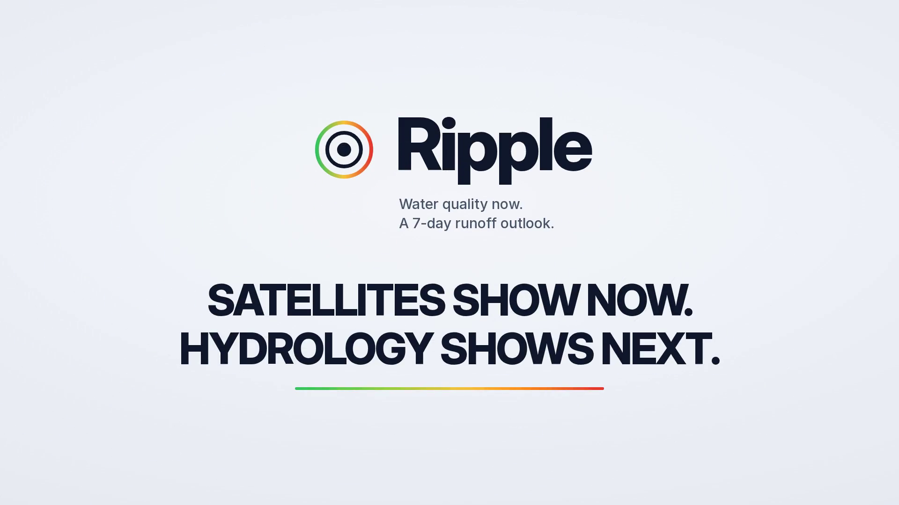
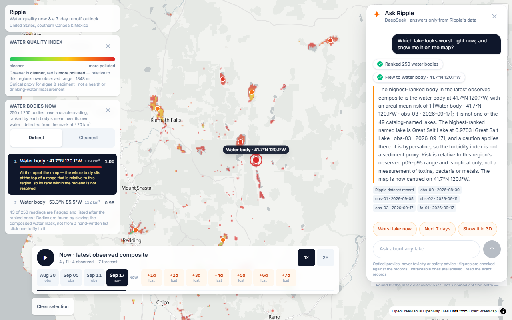
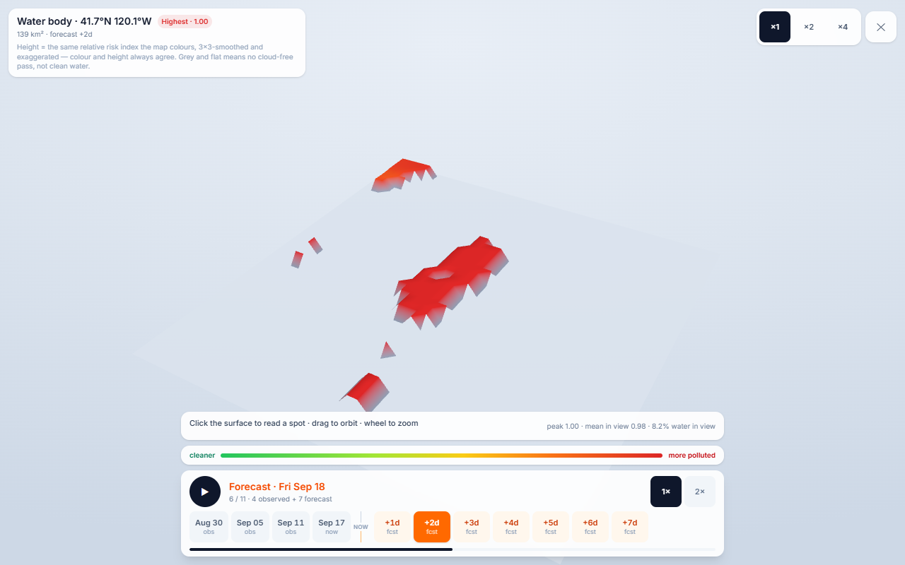
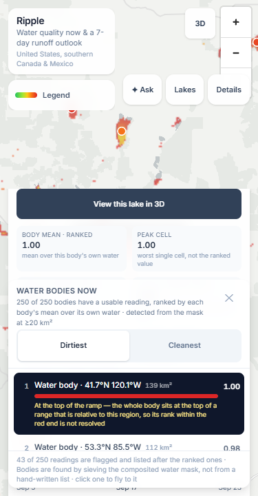
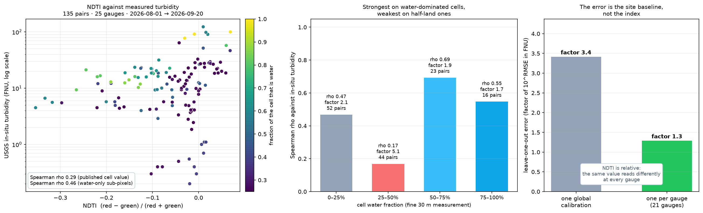

<div align="center">



# Ripple

**A weather-radar-style forecast map for lake and river water quality.**

Water quality now, and where new sediment and nutrient loading is likely over the next
seven days — computed live from key-free public satellite and weather data.

[**Live demo**](https://ripple-liart.vercel.app) · [**60-second film**](https://youtu.be/RRrjp6yFFd8) · [**Full engineering record**](docs/RIPPLE-HACKATHON-DOCS.md)


</div>

---

## What this is

Ripple is a satellite water-quality layer with a timeline, not a snapshot. Four rolling
Sentinel-2 composites show the last six weeks of change in the water; a 7-day rainfall-runoff
outlook shows where new loading is likely next; and every number on screen can be traced back
to the scene, the cell and the frame it came from.

It is built around one rule: **do not claim more than the data supports.** The colour ramp is
relative to each region's own observed range, never a health standard. Cyanobacteria and
toxicity are refused by design — Sentinel-2 has no 620 nm band, so the honest answer is
"bloom intensity only". And the numbers are checked against measurements rather than asserted.

| | |
|---|---|
| **Region** | Continental US, southern Canada and Mexico (128°W–60°W, 18°N–54°N) |
| **Grid** | 4096 × 2777 px Web Mercator, ~1,848 m per pixel |
| **Frames** | 4 observed composites (12-day rolling windows, 6 days apart) + 7 forecast days |
| **Bodies** | 250 discovered from the mask itself, 49 named from a catalogue |
| **Indices** | NDCI (bloom intensity), NDTI (turbidity / suspended sediment) |
| **Ground truth** | 135 matched pairs against 25 USGS NWIS in-situ turbidity gauges |
| **Data cost** | Every data source is key-free; the only paid component is the assistant's model, and it is opt-in |

## Who it's for

- **Anyone who watches a lake.** A swimmer, a paddler, an angler, a cottage owner: open the
  map, find your water, and see whether it is clearer or dirtier than it usually is, and
  whether the coming week's rain is likely to wash more in.
- **Anyone who reports on water.** The colour ramp is relative to each region's own observed
  range, so the map can say "this bay is the most turbid it has been in six weeks" without
  pretending to be a health standard — and every number traces back to the scene, cell and
  frame it came from.
- **Anyone who checks the numbers.** The turbidity signal is validated against 135 USGS gauge
  pairs with the error stated rather than hidden, and the assistant's every figure is checked
  against the shipped records before it is shown.

It is not a regulatory tool, and it will not tell you whether water is safe to drink or swim
in. It tells you where the water is changing, and where the next rain is likely to push more
sediment and nutrients in.

## Where the AI is

Only one part of Ripple is a language model, and it is the smallest part.

| Where | What it is | How it is checked |
|---|---|---|
| **The calibration** | the NDTI → turbidity mapping is a fitted log-linear model, not a hand-picked constant | leave-one-out cross-validation: one global fit leaves a factor of 3.4, per-gauge fits leave 1.3 — both reported, neither rounded down |
| **The agent** | a tool-calling loop over DeepSeek — five tools, capped at two model calls — answering only from the shipped records | data tools run server-side and their results re-enter the model's context, so numbers come from records, not prose |
| **The guards** | the deterministic filters around the model: scope gate, name resolution, number guard | each has a negative control — a fabricated figure the guard must catch, a name the resolver must refuse |

## Feature tour

**The radar loop.** Four best-pixel composites, each a rolling 12-day window, all normalised
against the *latest* frame's range so the animation shows change in the water rather than a
per-frame rescaling. Grey means "no cloud-free pass in that window" — never "clean water".

**The leaderboard.** Every discovered body ranked by the areal mean of its own water, with a
dirtiest/cleanest toggle. Ranking on a body's worst cell reported one extreme 1.85 km pixel as
the body's reading, and 221 of the 250 bodies contain at least one saturated cell — so the
peak ranked nothing. Bodies whose reading is *not a reading of that body* are flagged and
listed after the ranked ones: a peak-versus-mean gap over 0.4, a footprint sample under 12
cells or under 25% of the body, or a catalogued index caution (Great Salt Lake is hypersaline,
so NDTI is not a sediment proxy there).

**The detail panel.** Body mean and peak cell side by side, sampled-cell count and the share of
the body it covers, the NDCI and NDTI of the sampled pixel (labelled as such, so they stay
comparable with a single gauge), the observed history, a 7-day outlook chart, and the forecast
inputs — rain, antecedent rain, curve number, runoff — so the line can be checked rather than
trusted.

<div align="center">

</div>

**Ask Ripple** is a grounded agent, not a chatbot on a map. It answers questions about the
shipped dataset and acts on the map while it does — ranking the catalogue, reading a body's
outlook, flying to a body, stepping the timeline, opening the 3D view. Every step is a chip in
the transcript that only turns green once the app reports the effect actually ran. See
[The assistant](#the-assistant) for how it is kept honest.

<div align="center">

</div>

**Two 3D views, the same numbers.** The map's *3D* control tilts the map and drapes the overlay
over real terrain so lakes sit in their actual basins. A body's panel offers *View this lake in
3D*: a full-screen relief built from the very tile on screen, where height and colour are the
same relative index, clickable to read a value with coordinates.

<div align="center">

</div>

## Validation against real measurements

The turbidity signal is checked against in-situ data, not just against spectra. Every active
USGS continuous turbidity series in the region was enumerated, filtered to gauges that sit on
cells this product maps as water, and matched to a Sentinel-2 overpass within ±3 hours — read
**exactly the way the pipeline reads it**, so the comparison is against the published number.

<div align="center">

</div>

| NDTI variant | pairs | Spearman rho | R² on log₁₀ FNU | leave-one-out accuracy |
|---|---|---|---|---|
| **Published cell value** (what the map draws) | 135 | **0.29** | 0.02 | factor **3.5** |
| Water-only sub-pixels (~30 m) | 135 | **0.46** | 0.45 | factor **2.5** |
| Cells ≥ 25% water | 83 | 0.18 | — | factor **4.4** |
| Cells ≥ 50% water | 39 | **0.67** | — | factor **1.8** |
| Cells ≥ 75% water | 16 | 0.55 | — | factor **1.7** |

The honest reading: NDTI tracks measured turbidity weakly at the published cell, clearly
better on the water-only sub-pixels, and best where the cell is mostly water — 0.67 and a
factor of 1.8 at ≥ 50%. The strata are cumulative and deliberately not monotonic: the weakest
row is ≥ 25%, because the half-land band inside it (25–50% water) is the hard case — a
narrow, sediment-loaded channel sharing its pixel with shore and land.

The dominant error term, though, is not mixing: it is the site-specific optical baseline. One
global line through every gauge leaves an RMSE of 0.534 in log₁₀ FNU — a factor of 3.4.
Fitting each gauge against its own pairs (21 of 25 gauges have enough pairs) leaves a factor
of 1.3. NDTI carries the signal; a single calibration cannot transfer it between a clear
mountain creek and a sediment-loaded irrigation return. That is why the roadmap's first item
is per-water-body baselines at native resolution.

Full pair table with every scene id, water fraction and sample count:
[`docs/validation/`](docs/validation/).

## The assistant

The assistant's problem is that a language model cannot be made incapable of inventing a
number. So it is not built to promise that; it is built so that invention is **detectable,
visible and testable**.

| Layer | What it does |
|---|---|
| **Fact base** | `assistant_context.py` copies the shipped manifest and the validation summary into `data/assistant.json` — 250 body records with every frame, forecast input and caution. It copies; it derives nothing. |
| **Retrieval** | Deterministic scoring over that file, so the same question always yields the same records and a test can assert which ones. |
| **Scope gate** | Non-environment questions are refused **before** the model is called: 0 ms, no tokens, and deterministic rather than sampled. |
| **Tool calling** | `deepseek-flash` calls five tools. Data tools run server-side and their results re-enter the model's context, so numbers come from records, not from prose. View tools return to the browser, because only the browser can move a map. Capped at two model calls. |
| **Name resolution** | Every body name a model produces is resolved against the catalogue before it becomes an action — an exact name, an id, or a distinctive token, and nothing else. The map can never fly to a lake that is not in the data, and an ambiguous "the lake" is refused rather than guessed. |
| **Number guard** | Every figure in an answer must trace to a record or a tool result — verbatim, correctly rounded or truncated, or in percent form. Anything else is labelled in the answer as an unverified figure. |

It also knows the difference between a missing record and a missing *capability*: "show me
Georgian Bay in 3D" is an action, not a data gap. Asked about Lake Baikal, forests, FNU values
or cyanobacteria counts, it says what is missing instead of answering from the model's own
knowledge.

**The key never reaches the browser.** The model call happens in a serverless function with the
key in an environment variable; the client bundle is scanned for it on every deploy. Copy
[`app/.env.example`](app/.env.example) to `app/.env.local` for local development.

## Architecture

```
                    Sentinel-2 L2A  (AWS sentinel-cogs via Earth Search STAC, key-free)
                            │
        ┌───────────────────┴────────────────────┐
        │  pipeline/  (Python 3 · rasterio · numpy)│
        │                                          │
        │  mosaic 4 rolling windows ──► best-pixel composite
        │  SCL majority vote ──► water mask ──► discovery of 250 bodies
        │  NDCI + NDTI ──► relative risk ──► areal mean per body footprint
        │  Open-Meteo rainfall ──► SCS curve number ──► 7-day outlook
        └───────────────────┬────────────────────┘
                            │  manifest.json + lossless WebP tiles + assistant.json
        ┌───────────────────┴────────────────────┐
        │  app/  (Vite 7 · React 19 · TS · MapLibre GL 6 · three.js)│
        │  map · timeline · leaderboard · detail panel · 3D views   │
        └───────────────────┬────────────────────┘
                            │  POST /api/assistant
        ┌───────────────────┴────────────────────┐
        │  api/assistant.ts  (Vercel function)     │
        │  fact base → retrieve → scope gate → DeepSeek tools → number guard
        └──────────────────────────────────────────┘
```

## Quickstart

The repository ships the generated data (`app/public/data`, ~5 MB), so the app runs
immediately — no pipeline build required.

```bash
cd app
npm install
npm run dev            # http://localhost:5173
```

The map, timeline, leaderboard, forecasts and 3D views all work with no configuration. The
assistant needs a model key (see [app/.env.example](app/.env.example)); without one the panel
says it is not configured and nothing else changes.

### Rebuilding the data

```bash
cd pipeline
python -m pytest tests/ -q -m "not network"        # 199 offline tests
python -m pytest tests/ -q -m network              # 21 live tests
python -m ripple_pipeline.cli --out ../app/public/data
```

A continental build reads ~7,000 remote scenes once each through HTTP range requests (~1.5 h).
It needs no keys, no accounts and no tokens.

### Validating the index, and regenerating the assistant's facts

```bash
cd pipeline
python -m ripple_pipeline.validation               # live USGS NWIS comparison → docs/validation/
python -m ripple_pipeline.assistant_context        # manifest + validation → app/public/data/assistant.json
```

### Verifying the app

```bash
cd app && npm run typecheck && npx vitest run      # 167 tests
python tools/verify_app.py http://localhost:4173 --out screens/verify
python tools/interaction_check.py http://localhost:4173 --out screens/verify
```

The two browser harnesses drive real clicks — ranking selection, map sampling, keyboard
scrubbing, probe loading, both 3D views, frame stepping, disposal, and the assistant's refusal
path — and assert on the resulting DOM, because a screenshot cannot prove that "click a lake
for its forecast" works.

## Project structure

```
Ripple/
├── pipeline/                  Python: everything that touches satellite data
│   ├── ripple_pipeline/
│   │   ├── cli.py             orchestration: frames, bodies, forecast, manifest
│   │   ├── stac.py            scene discovery, ranked by AOI coverage
│   │   ├── cog.py             windowed COG reads
│   │   ├── composite.py       best-pixel compositing
│   │   ├── indices.py         NDCI, NDTI, the composite risk score
│   │   ├── waters.py          body discovery, footprints, areal statistics
│   │   ├── forecast_field.py  rainfall → SCS-CN → loading anomaly
│   │   ├── validation.py      the USGS NWIS comparison
│   │   ├── assistant_context.py  the assistant's fact base
│   │   └── backfill.py        recompute body statistics from delivered tiles
│   └── tests/                 220 tests, 21 of them live network
├── app/                       Vite + React + TypeScript
│   ├── api/assistant.ts       the grounded assistant endpoint
│   ├── src/
│   │   ├── map/               MapLibre view, markers, 3D terrain mode
│   │   ├── timeline/          the radar-style frame loop
│   │   ├── leaderboard/       ranking, flags, demotion
│   │   ├── detail/            body panel and forecast chart
│   │   ├── lake3d/            the three.js relief
│   │   ├── assistant/         panel, retrieval, guards, actions
│   │   └── domain/            types, palette
│   └── public/data/           the shipped manifest, tiles and fact base
├── tools/                     the two browser verification harnesses
├── docs/                      the full engineering record + validation report
└── media/                     screenshots and the 60-second film
```

## How this was built

The history is ordered the way the project was built — the pipeline first, then the data,
then the app, then the validation and this record. The engineering record in
[`docs/`](docs/RIPPLE-HACKATHON-DOCS.md) keeps the failure each rule came from.

Every rule below was paid for by a bug that survived type-checking and unit tests. The full
table, with the failure each one came from, is in
[the engineering record §7](docs/RIPPLE-HACKATHON-DOCS.md).

- **Never trust a STAC-declared scale/offset** — derive it and assert physical sanity.
- **Rank scenes by AOI coverage, not granule cloud cover.**
- **Composite on usability, vote on the class layer.**
- **Never use NDWI/MNDWI as a turbid-water mask** (0.2% recall on western Lake Erie).
- **A body's reading is its own area, not one cell in it.**
- **Validate the published number, and say which number that is.**
- **Re-derive an id from the pipeline's own constants, never from its geometry.**
- **Prove the check can fail before trusting a pass** — every guard in this repo has a
  negative control: a fabricated figure the number guard must catch, a name the resolver must
  refuse, a collision the assembly check must report.

## Limitations

Stated plainly, because a water-quality map that overstates itself is worse than no map:

- **Optical proxies only.** Nothing here detects toxins, bacteria or metals.
- **Never cyanobacteria, never toxicity.** That needs the phycocyanin feature near 620 nm,
  which Sentinel-2 does not sample. Bloom *intensity* only.
- **The index is relative** to this region's observed range: 0.5 is the middle of that range,
  not a threshold, and not a health standard.
- **Resolution is ~1.85 km.** A 20 km² body is about six cells. The largest measured source of
  error is the site-specific optical baseline, not the pixel mixing that resolution brings —
  both are quantified in [Validation](#validation-against-real-measurements).
- **The 7-day outlook is a relative loading anomaly**, not a concentration forecast: no
  catchment routing, no travel time, no calibrated yield.
- **Cloud is not pollution.** Grey means no cloud-free observation in that window.
- **The assistant is a way into this dataset, not a general chatbot.** Its figures are checked
  against the records before display and untraceable ones are labelled, but the guard makes
  invention *visible* — it does not make it impossible.

## Data sources

| Source | Used for | Account |
|---|---|---|
| AWS `sentinel-cogs` via Earth Search STAC | Sentinel-2 L2A surface reflectance | none |
| Open-Meteo forecast API | rainfall for the outlook frames and point forecasts | none |
| Open-Meteo Flood API (GloFAS) | discharge ensemble client with an anti-snap guard | none |
| USGS Water Data OGC API (NWIS) | in-situ turbidity for validation | none |
| Natural Earth | ocean polygons, so lakes are separated from the sea | none |
| OpenFreeMap | basemap tiles | none |
| AWS / Mapzen terrain tiles | DEM for the map's 3D mode, only while it is on | none |
| DeepSeek API | the assistant's prose only — opt-in, key held server-side | key (paid) |

The key-free constraint is architectural rather than incidental: no keys, tokens or secrets
exist in the codebase, so the demo cannot fail because a quota ran out. The assistant is the
single exception and it is walled off — its key lives in an environment variable, is used only
by one serverless function, is never shipped to the client, and its absence degrades to a
panel that says so.

## Credits

Built by **Praditya Farell** for the **ML Empowerment Build Challenge 3.0**.

Scientific references: NDCI after Mishra & Mishra (2012); NDTI after Lacaux et al. (2007); the
runoff response follows the USDA SCS curve-number method.

<div align="center">
<sub>Optical proxies, not a regulatory measurement · not for drinking or swimming decisions · bloom intensity only</sub>
</div>
