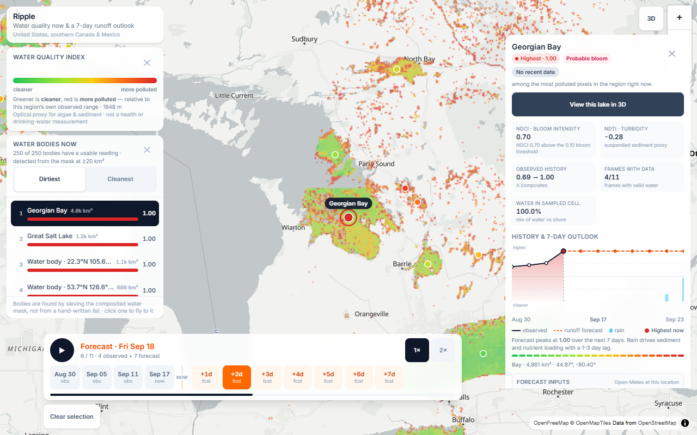
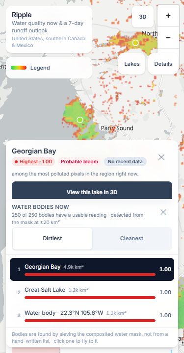
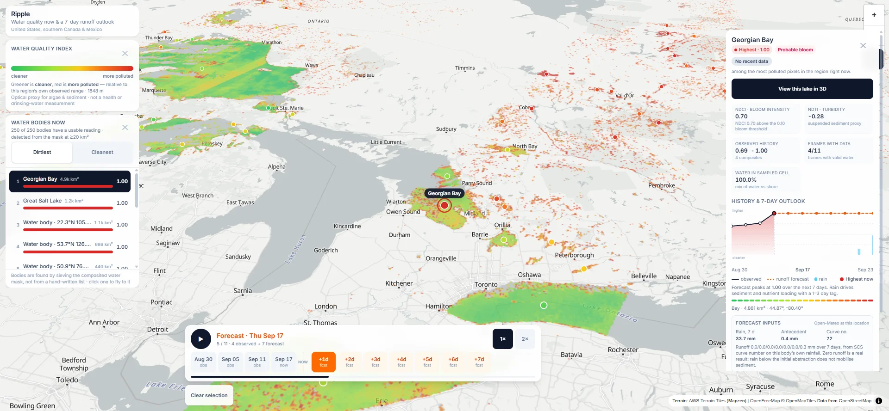
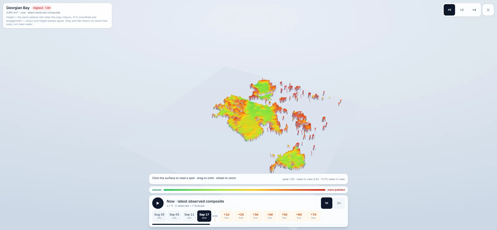

# Ripple — Water-Quality Forecast Map

**Hackathon documentation — complete system, pipeline, and engineering record.**

Ripple is a weather-radar-style forecast map for lake and river water quality. A rolling
satellite time series shows what the water looks like now, and a 7-day rainfall-runoff
outlook shows where new sediment and nutrient loading is likely next. Green means cleaner,
red means more polluted, and everything is computed live from key-free public data.

Snapshot of the shipped build: **250 water bodies discovered and measured**, **11 frames
(4 observed + 7 forecast)**, **1,800 satellite scenes mosaicked** into the latest composite,
at **~1.85 km/pixel** across the United States, southern Canada and Mexico.

---

## 1. At a Glance

| **Field** | **Value** |
|---|---|
| **Name** | Ripple |
| **Live** | https://ripple-liart.vercel.app — public, no login (Vercel free tier, static deploy) |
| **One-liner** | A weather-radar-style forecast map for lake and river water quality |
| **Tagline in the UI** | Water quality now & a 7-day runoff outlook |
| **Region covered** | Continental US, southern Canada and Mexico — bbox 128°W–60°W, 18°N–54°N |
| **Grid** | 4096 × 2777 pixels, Web Mercator, effective resolution ~1,848 m/pixel |
| **Observed frames** | 4 rolling composites, 12-day windows, 6 days apart, oldest first |
| **Forecast frames** | 7 days of SCS curve-number runoff response to Open-Meteo rainfall |
| **Water bodies** | 250 discovered from the data (229 lakes, 18 reservoirs, 3 bays), 49 named from a catalog |
| **Indices** | NDCI (algal bloom intensity), NDTI (turbidity / suspended sediment) |
| **Data cost** | 100% key-free public sources — no accounts, no tokens, no secrets |
| **Pipeline** | Python 3 + rasterio + numpy, ~7,000 remote scenes read once each (~1.5 h realistic continental build) |
| **App** | Vite 7 + React 19 + TypeScript 5.9 + Tailwind 4 + MapLibre GL 6 + three.js |
| **Tests** | 220 pipeline tests (pytest) + 167 app tests (vitest), plus headless invariant and real-interaction checks |
| **Validation** | 135 matched satellite/gauge pairs against 25 USGS NWIS turbidity gauges (Spearman rho 0.29 published-cell, 0.46 water-only; see §8.4) |
| **Assistant** | Grounded, tool-calling agent over the shipped dataset only: it ranks, reads, flies to a body, steps frames and opens 3D (§9.1) |
| **Verification** | 33/33 interaction checks passed, 0 console errors, overflow-free at 375/768/1280 px |

## 2. The Problem We Set Out to Solve

Water quality is something people care about at the scale of *their* lake — is it safe to
swim, is the bloom back, why is the water brown after the storm. The information that
answers those questions exists, but it is scattered and hard to read:

- **Satellite data is abundant but raw.** Sentinel-2 photographs every point on Earth every
  few days at 10–20 m resolution, for free. But the public tools around it are built for
  scientists: band math, cloud masks, acquisition dates, granular scene metadata.
- **In-situ sensors are sparse and lag.** USGS gauges report turbidity and nitrate in
  near-real time, but only for the sites that have them, and the public interfaces are
  spreadsheets and station lists, not maps. They are not sparse enough to skip as
  *ground truth*, though — which is what §8.4 uses them for.
- **There is no forecast.** Existing water-quality maps show a snapshot from the last clear
  satellite pass — often days or weeks old. Nobody shows *what is about to happen*, even
  though the dominant driver is physically predictable: rainfall mobilises sediment and
  nutrients from the catchment, and the water responds 1–3 days later.
- **Bloom season is a moving picture.** Algal blooms grow, drift and die over days. A
  static map cannot show that; an animation can.

The most reliable public signal for a harmful algal bloom — chlorophyll-a — is measurable
from space by its optical signature. The second — turbidity and suspended sediment — is
equally measurable. Meanwhile, the trigger is rain. Ripple connects the two: satellites
supply *now*, hydrology supplies *next*.

## 3. What Ripple Is — and What It Deliberately Is Not

Ripple is a **relative water-quality index** presented like a weather radar layer:

- A light basemap carries a green-to-red raster overlay of pollution risk for the water
  only. Land is never coloured.
- A timeline scrubber runs from observed composites on the left, through **now**, into a
  7-day forecast on the right, with a play button that animates the loop like radar.
- Clicking a water body opens its history, bloom index, forecast and the raw inputs behind
  that forecast, so the number can be checked rather than trusted.

Equally important is what it refuses to claim:

- **Not a regulatory measurement.** Ripple retrieves optical proxies from satellite imagery,
  not toxins, bacteria or metals. The disclaimer is machine-readable in the manifest and
  visible in the UI.
- **Never cyanobacteria, never toxicity.** Discriminating cyanobacteria from green algae
  needs the phycocyanin absorption feature near 620 nm, which Sentinel-2 does not have. The
  app reports bloom *intensity* and stops there. A red-edge ratio would detect *a* bloom
  while being unable to say whether it is toxic — precisely the distinction a reader would
  rely on. So the honest call is to not make it (see §8).
- **Not an absolute standard.** The colour ramp is normalised to the region's own observed
  p05–p95 range: 0.5 means "middle of this region's observed range", not a threshold.

## 4. Feature Tour



**The radar loop.** Four best-pixel composites, each a rolling 12-day window, 6 days apart,
oldest first. All four frames are normalised against the *latest* frame's range, so the
animation shows change in the water rather than a per-frame rescaling. The newest week is
often overcast somewhere; the older frames still carry that area's last clear observation.
Grey means "no cloud-free pass in this window" — never "clean water".

**The leaderboard.** Every discovered water body ranked by **the areal mean of its own
water**, with a dirtiest/cleanest toggle. The mean is the point: ranking on a body's worst
cell reported the single most extreme 1.85 km pixel as the body's reading, and in this build
221 of the 250 bodies contain at least one cell pinned at the top of the ramp — so the "peak"
was a distinction without a difference, and the leaderboard opened on a tie. Bodies whose
reading is *not a reading of that body* are flagged and listed after the ranked ones: a
peak-versus-mean gap over 0.4 (Georgian Bay reads 0.49 as a body while one of its cells
reads a saturated 1.00), a footprint sample under 12 cells or under 25% of the body, and a
catalogued index caution (Great Salt Lake is hypersaline, so NDTI is not a sediment proxy
there). Selecting a row flies the map to the body and opens its detail panel. The same mean
colours the body's map marker, so the list and the map cannot disagree about a *body* — the
raster underneath stays per-pixel, and the peak cell is on every row for exactly that reason.

**The detail panel.** For a catalogued body: the body mean and the peak cell side by side,
the sampled-cell count and the share of the body it covers, the NDCI and NDTI of the
sampled pixel (labelled as such, so they stay comparable with a single in-situ gauge),
observed risk range, confidence badge, a history + 7-day outlook chart, and the forecast
inputs (rain, antecedent rain, curve number, runoff) shown so the line can be verified. Any
flag on the reading is stated in full rather than being left for the reader to infer. For an
arbitrary point: a sampled history from decimated probe rasters with the sample footprint
stated, because a single probe pixel is not a measurement.

**Point inspection.** Click anywhere on the map to sample that coordinate across every frame.
Probe rasters are decoded lazily on the first click, at 1024 px long edge (a ~7.4 km sample
footprint at this grid).

**Two 3D views, same numbers as the map.** The map's *3D* control tilts the map and drapes
the overlay over key-free terrain so lakes sit in their real basins. A body's panel offers
*View this lake in 3D*: a full-screen relief built from the very tile on screen, where
height and colour are the same relative risk index. It plays the loop like the map does —
the bloom season moves as terrain.

**The honesty layer.** A confidence badge derived from valid pixel count, cloud state and
days since the last usable pass; the satellite pass date; the disclaimer; "no recent data"
states instead of stale colour; and provisional thresholds labelled as such.

**Keyboard and touch.** Arrow keys step frames, space plays, Escape unwinds one layer at a
time (3D view first, then the selection). Every control is at least 44 × 44 px, and the
layout is verified at 375 / 768 / 1280 px.

## 5. Architecture Overview

Two halves, one contract: a Python pipeline that turns the satellite archive into small
tiles plus a JSON manifest, and a browser app that renders that manifest as an interactive
map. No server, no database, no keys — the output folder *is* the API.

<!-- diagram:pipeline -->

**The build's numbers at a glance:**

| Quantity | Value |
|---|---|
| Analysis grid | 4096 × 2777 px, EPSG:3857, effective 1,848 m/px |
| Scenes folded into the latest composite | 1,800 |
| Satellite-valid fraction of grid (latest) | 31.0% |
| Water fraction of grid (latest) | 1.61% |
| Discovered water bodies | 250 (229 lakes, 18 reservoirs, 3 bays) |
| Named from the catalog | 49 |
| Frames emitted | 11 (4 observed + 7 forecast) |
| Tiles per frame | 2 (display, up to 4096 px + probe, 1024 px), lossless WebP |
| Latest NDCI normalisation range (p05–p95) | −0.304 … +0.582 |
| Latest NDTI normalisation range (p05–p95) | −0.615 … +0.057 |

## 6. The Pipeline, Stage by Stage

The pipeline is one command: `python -m ripple_pipeline.cli --out ../app/public/data`. What
follows is what happens inside, in order.

### 6.1 Region and grid

The analysis region is the continental US, southern Canada and Mexico
(`-128, 18, -60, 54`). A single image overlay cannot span two continents usefully — North
plus South America is ~136° of longitude, which lands at ~3.7 km/px where a 10 km² lake is
half a pixel — so this region is the largest area that stays under 2 km/px in one overlay.
The grid is built directly in Web Mercator (`EPSG:3857`), which is also the projection
MapLibre renders in, avoiding a latitude-dependent stretch in the browser. The long edge is
capped at 4096 px (WebGL texture limits); the *effective* resolution is reported honestly in
the manifest as `resolution_m` rather than hidden.

### 6.2 Scene discovery (STAC)

Candidates come from the Earth Search STAC API over the public AWS `sentinel-cogs` bucket —
Sentinel-2 L2A surface reflectance COGs, no auth, read over HTTP range requests.

- The region is split into a 1.5° search grid; each cell asks for up to 12 granule
  candidates per time window (cloud ≤ 60%).
- **Each time window is searched separately (R6).** STAC returns the newest items first, so
  a single search across the whole lookback only reaches the most recent weeks — the oldest
  windows of the radar loop would quietly starve, and the animation would open on a
  half-empty map.
- **Scenes are ranked by AOI coverage, not cloud cover (R2).** Cloud cover is a
  whole-granule statistic. A Sentinel-2 granule is a rotated parallelogram, and the
  *clearest* available scene for a western-Erie AOI (0.00% cloud) covered only 41.4% of it,
  because it merely clipped the corner. Ranking by valid coverage inside the AOI found a
  100% scene instead.
- **Pure-ocean search cells are skipped.** The ocean can contribute nothing (it is removed
  from the water mask), and on the continental grid ~38% of the search grid is ocean.
  Skipping those cells removes ~360 searches that would otherwise consume the
  newest-first reading budget before any land scene is reached.

### 6.3 Reading pixels and validating scaling

Each candidate scene is read once as needed and reprojected onto the analysis grid.

- **Reflectance is read with bilinear averaging** so one noisy 10 m pixel cannot set the
  value of a ~2 km cell.
- **The class layer is read nearest-neighbour at twice the grid resolution** (see 6.4).
- **Scaling is derived, then asserted (R1).** Earth Search advertises
  `scale: 0.0001, offset: -0.1`, but the stored DN *already* has that offset applied.
  Applying the advertised offset drives clear-water NIR reflectance to −0.0947 over Lake
  Superior — physically impossible. The correct transform is `reflectance = DN × 1e-4`, and
  the decisive signature of the bug is **negativity**: the validation asserts no reflectance
  below a −0.001 floor and halts the scene rather than emitting numbers. An earlier version
  also required blue ≥ red over water; that was reported as a statistic instead
  (`scaling.blue_dominant`) after it produced false positives on two legitimately
  red-dominant waters — turbid Lake Winnipeg and hypersaline Great Salt Lake. Physics is
  checked with sign and ordering, never with an assumption about which water types are
  present.
- **`DN == 0` is masked before any arithmetic (R3).** `nodata = 0`. With no offset applied,
  `DN 0` becomes reflectance `0.0` — a valid-looking value that poisons every index and the
  forecast baseline. Masking happens on raw DN, never on scaled reflectance.

### 6.4 Water masking

**Reflectance-based water indices are not used for masking (R4).** On western Lake Erie,
NDWI flagged 54 of 23,153 obvious water pixels (0.2%) and MNDWI 0.1% — both failed badly.
Turbid water raises NIR and SWIR, driving both indices negative over open water, so neither
can be trusted on the very water bodies with something to report. Instead:

- **Daily usability comes from Sentinel-2's SCL** (scene classification layer): cloud,
  cloud shadow, cirrus, snow, saturated and no-data pixels are excluded; water and
  (where the JRC backbone agrees) unclassified pixels are kept.
- **The class layer is categorical, so it is majority-voted.** At 1.85 km, a single
  nearest-sampled 20 m pixel would decide a 3.4 km² cell — a coin flip on a shoreline. The
  SCL is read at twice the grid resolution and aggregated into a water fraction per cell
  (a cell counts as water at ≥ 25% sub-samples). This is what makes narrow reservoirs
  (Lake Oahe, Kentucky Lake) register at all instead of reading as land.
- **The ocean is subtracted (R9).** Natural Earth's ocean polygons are rasterised to the
  grid, removed from the water mask, and used to skip ocean search cells. Without this, the
  ocean fragments in the mosaic measured up to 193,000 km² and outranked every real lake in
  the ranking — a coastal fragment even claimed the name "Lake Marion".
- **Region-edge water is removed** — water that still reaches the analysis border is an
  artifact of where the box was drawn, not a lake.

### 6.5 Index mathematics at 250 m

All indices are computed on the composited reflectance at the grid resolution, masked to
water, then composited in time.

| Index | Formula | Measures | Reference |
|---|---|---|---|
| NDCI | `(B05 − B04) / (B05 + B04)` | chlorophyll-a / algal bloom intensity | Mishra and Mishra 2012 |
| NDTI | `(B04 − B03) / (B04 + B03)` | turbidity / suspended sediment | Lacaux et al. 2007 |

Band centres: B03 560 nm, B04 665 nm, B05 705 nm, B08 842 nm, B11 1610 nm. Ripple uses the
red-edge NDCI formulation designed for chlorophyll retrieval, not a raw vegetation index.

### 6.6 Temporal compositing

**Composite on usability, not recency, and vote on the class layer (R5).** A cloudy pass
must not erase a clear observation from days earlier, so per pixel the most recent scene
that observed it *usably* wins, and reflectance and SCL always come from the same
acquisition. The result is a gap-free, radar-like layer instead of a holey single pass that
would read as a data outage.

Two runtime properties were paid for in measured time:

- **Read each scene once for all overlapping windows (R7).** Rolling windows overlap;
  re-reading the overlap cost ~35% of runtime for identical pixels. Each scene is fetched
  once and folded into every window whose dates contain it.
- **Stop when it stops paying.** A window stops after 30 scenes that add less than the
  progress threshold (0.02% of the grid, scaled by the scene's footprint share on large
  grids). Scenes that no longer have an unfinished window to land in are skipped for free,
  which is what prevents a capped window's leftovers from wasting the whole reading budget.

**Normalisation is fixed to the latest frame.** The newest composite sets the p05–p95 range
for both indices, and every earlier frame is rendered against that same range. Per-frame
normalisation would make every frame span the full colour ramp, hiding the very signal the
animation exists to show.

### 6.7 Water-body discovery and naming

**Coverage is discovered, not declared (R8).** An earlier build covered 29 hand-listed
lakes, which is why whole states could be empty while the mask had water in them. Now the
composited water mask is sieved and polygonised; every patch ≥ 20 km² is measured (ground
area, centroid), named from a catalog index when one is within 25 km of its footprint, and
otherwise named by its coordinates. Mercator area is inflated by 1/cos²(latitude), so the
correction is applied at the centroid. Discovery finds what the satellite can actually
resolve — nothing is asserted about lakes below the detection threshold. The catalog match
uses the patch's *footprint*, not its area centroid, because a large lake's centroid can sit
farther from its catalog point than a small lake's whole extent.

### 6.8 The forecast field

Forecast frames are the latest observed water mask plus a rainfall-driven loading anomaly,
computed per cell on a coarse sample grid and smoothed:

```
S      = 25400 / CN − 254
Ia     = 0.2 S
runoff = (P − Ia)² / (P − Ia + S)     for P > Ia else 0
anomaly = min(1, runoff × erosion_factor(row_crop) / 25)
```

`P` is Open-Meteo forecast rainfall over a 24 h window. `CN` comes from land cover and
hydrologic soil group and is damped by antecedent moisture (5-day rainfall with USDA AMC
breaks at 13 mm and 28 mm). Erosion factors are published relative sediment-delivery
multipliers: row-crop 1.0, bare/fallow 1.4, pasture 0.5, forest 0.15, wetland 0.1,
urban/impervious 1.2, water 0.0. These are relative weights for ranking risk, not calibrated
yields — and the UI never presents them as concentrations.

**Zero runoff is a real result.** Rain below the initial abstraction does not mobilise
sediment, and the app says so rather than inventing a signal.

Every body also carries its own forecast from its own rainfall (`body.forecast` in the
manifest): baseline risk, antecedent rainfall, curve number, and per-day rain / runoff /
risk. Those are the actual inputs, reported so the line on the chart can be checked.

### 6.9 Tiles and the manifest

Each frame is written twice: a display tile (up to 4096 px) and a decimated probe tile
(≤ 1024 px) used for click-to-inspect, both **lossless WebP** (~2–3× smaller than PNG for
these tiles). The manifest (`schema_version: 2`) is the app's entire API:

- `frames[]` — id, kind, label, dates, tiles, scene counts, coverage, baselines.
- `water_bodies[]` — name, area, coordinates, per-frame risk / NDCI / NDTI / water fraction,
  per-day forecast rainfall, and per-body forecast inputs and outputs.
- `discovery` — the threshold, the cap, and how many bodies were found and named, so the UI
  states its own coverage from the data.
- `normalization`, `palette`, `scales`, `probe`, `grid`, `resolution_m`, `disclaimer`.

The run also prunes tiles from previous runs that the new manifest does not reference, so
renaming a frame never leaves orphaned megabytes shipped to the browser.

## 7. Nine Rules, Each Paid For with a Measurement

Every rule below exists because an obvious assumption was tested and failed. Each is
enforced in code and covered by tests.

| # | Rule | What it prevents |
|---|---|---|
| R1 | Never trust the STAC-declared offset; derive the transform and assert non-negativity | Clear-water NIR of −0.0947 from a doubly-applied offset; a failing scene halts, not warns |
| R2 | Rank scenes by AOI coverage, not cloud cover | A 0.00%-cloud granule covering 41.4% of the AOI beating a 100% one |
| R3 | Mask `DN == 0` before any arithmetic | Zero-DN cells becoming valid-looking reflectance 0.0 that poisons indices |
| R4 | Never use NDWI or MNDWI as the water mask | Turbid water driving both negative; 0.2% recall on western Erie |
| R5 | Composite on usability, vote on the class layer | A cloudy pass erasing a clear observation; a shoreline pixel deciding a 3.4 km² cell |
| R6 | Search each time window separately | Newest-first STAC starving the oldest frames of the radar loop |
| R7 | Read each scene once, fold into every window; stop at saturation | ~35% wasted runtime on overlapping reads; capped windows burning the budget |
| R8 | Discover coverage from the mask; never hand-list lakes | Whole states empty while the mask plainly had water |
| R9 | The ocean is water, and it is still not a lake | A 193,000 km² Pacific fragment outranking every real lake, and naming one "Lake Marion" |
| R10 | A body's reading is its own area, not one cell in it | Georgian Bay headlining the leaderboard at a saturated 1.00 while its body mean is 0.49; 221 of 250 bodies contain a saturated cell, so the peak ranked nothing |
| R11 | Validate the *published* number, and say which number that is | The first validation pass compared a nearest-sampled pixel, not the cell average the product draws; fixing the resampling moved rho from 0.18 to 0.29 and made the resolution penalty measurable |
| R12 | Re-derive an id from the pipeline's own constants, never from its geometry | A 0.006 m/cell resolution difference accumulating to 24 m and renaming a body across a two-decimal rounding boundary; the backfill now takes `resolution_m` from the manifest and refuses to write on any id mismatch |

## 8. The Science: Indices, Calibration, and What We Refuse to Claim

### 8.1 Calibration anchors

Measured from real Sentinel-2 scenes on corrected reflectance, medians over water pixels.
These are regression fixtures in `pipeline/tests/test_indices.py`:

| Water | Scene | NDCI | NDTI | Reading |
|---|---|---|---|---|
| Lake Superior, offshore | `S2C_16TDT_20260901_0_L2A` | −0.116 | −0.376 | Textbook clear water, monotone blue decay |
| Western Lake Erie | `S2A_17TLG_20260828_0_L2A` | −0.052 | −0.382 | Green-peaked, eutrophic |
| Lake Winnipeg | `S2C_14UPC_20260827_0_L2A` | +0.047 | −0.191 | Strong bloom signal, p90 +0.52 |

Three findings matter:

1. **NDCI reproduces known reality.** Superior shows the clear-water spectrum and negative
   NDCI. Erie and Winnipeg are green-peaked — the algal/eutrophic signature. Winnipeg's
   positive median with a p90 of +0.52 matches its severe annual cyanobacteria blooms. The
   pipeline recovers a real phenomenon, not noise.
2. **NDTI is a weaker discriminator on green-dominant lakes than expected.** All three read
   negative because all three are green-peaked, while published NDTI assumes
   mineral-sediment water where red > green. It still ranks the most turbid lake
   (Winnipeg) highest, and per-water-body percentile normalisation makes the sign
   irrelevant — which is exactly why that design choice exists. Documented as a limitation
   rather than papered over.
3. **Relative beats absolute.** Because the ramp is normalised against each region's own
   observed p05–p95, the colour has one coherent meaning everywhere ("where is the dirtiest
   water right now") without pretending to be a global standard. Absolute bloom detection
   (`NDCI > 0.1`, published threshold) is computed separately and reported as "bloom-prone
   water", never as colour.

### 8.2 Why cyanobacteria are deferred

Cyanobacteria were requested and were initially carried into v1. Checking the band
requirements killed that: discriminating cyanobacteria from green algae depends on the
**phycocyanin absorption feature near 620 nm**. Sentinel-2 has no band there — the nearest
are B04 at 665 nm and B05 at 705 nm. Published cyanobacteria indices (e.g. Wynne et al.)
were built for MERIS/OLCI, and cannot be reproduced from Sentinel-2 with defensible
accuracy. A red-edge ratio would detect *a* bloom while being unable to say whether it is
toxic — precisely the distinction a reader would rely on. True discrimination is deferred to
v2 alongside Sentinel-3 OLCI, which carries the 620 nm and 681 nm bands the official ESA
index requires.

### 8.3 Confidence and honesty, by design

- **Per-water-body confidence** derived from valid pixel count, cloud state, and days since
  the last usable pass. Shown as a badge, never hidden.
- **Seasonal darkness** is stated as "no data" rather than shown as stale colour.
- **Provisional thresholds** are labelled as such — NDTI baselines are regional: 0.174 is
  normal for the western Erie basin and would be an anomaly on Superior.
- **The disclaimer** ships in both the UI and the manifest: optical proxies, not a
  regulatory measurement, not for drinking or swimming decisions, bloom intensity only.

### 8.4 Validation against USGS in-situ turbidity

Everything above describes a proxy. This section is the part that checks it against a
measurement, because "the index reproduces a known spectrum" is not the same claim as "the
index tracks turbidity".

**Method.** Every active USGS continuous turbidity series (parameter 63680, FNU) in the
region was enumerated through the USGS Water Data OGC API, then filtered to the gauges that
sit on a cell the *delivered product* maps as water — a gauge the product reports no reading
for cannot validate it. For each gauge, Sentinel-2 L2A scenes over it in 2026-08-01 to
2026-09-20 were read **exactly the way the pipeline reads them**: reflectance bilinear-
averaged onto the 1,848 m cell, the class layer majority-voted into a water fraction, the
cell rejected below the mask's own 25% threshold, NDTI = (red − green) / (red + green). Each
scene was matched to the gauge's in-situ turbidity within ±3 h of overpass, taking the median
of the samples in that window, and one pair per gauge per acquisition day was kept (adjacent
tiles overlap, so a single overpass can return three granules containing the same cell).

**Result — 135 matched pairs across 25 gauges, 0.2–124 FNU:**

| NDTI variant | pairs | Spearman rho | p | R² on log₁₀ FNU | leave-one-out accuracy |
|---|---|---|---|---|---|
| **Published cell value** (what the map draws) | 135 | **0.29** | 5.8e-04 | 0.02 | factor **3.5** |
| Water-only sub-pixels (~30 m) | 135 | **0.46** | 1.6e-08 | 0.45 | factor **2.5** |

Splitting on how much of the cell the class layer calls water, with the thresholds fixed
before the run rather than after it:

| Cell water fraction | pairs | gauges | Spearman rho | leave-one-out accuracy |
|---|---|---|---|---|
| ≥ 0.25 | 83 | 17 | 0.18 | factor 4.4 |
| ≥ 0.50 | 39 | 9 | **0.67** | factor **1.8** |
| ≥ 0.75 | 16 | 3 | 0.55 | factor 1.7 |

**What the numbers say.** NDTI against in-situ turbidity is *weakly to moderately* positive.
The strata table is cumulative and deliberately not monotonic: the weakest row is ≥ 0.25,
because the half-land band inside it (25–50% water) is the hard case — a narrow,
sediment-loaded channel sharing its pixel with shore and land — while cells that are ≥ 50%
water rank at 0.67 and estimate to a factor of 1.8. Pixel mixing is a real error term, but it
is not the largest one. The largest is the site-specific optical baseline: one global line
through every gauge leaves an RMSE of 0.534 in log₁₀ FNU — a factor of 3.4 — while fitting
each gauge against its own pairs (21 of 25 gauges have enough pairs) leaves a factor of 1.3.
NDTI carries the signal; a single calibration cannot transfer it between a clear mountain
creek and a sediment-loaded irrigation return. The headline is reported at both levels — the
product's published number *and* the water-only number — because quoting only the second would
hide the resolution limit and quoting only the first would misattribute it to the index.

**What it does not establish.** A gauge measures one point, usually at a bank; a cell
averages ~3.4 km². The log-linear fit is empirical and site-transfer, not a physical
inversion; it is not a universal calibration. And nothing here tests toxins, bacteria,
metals or cyanobacteria — see §8.2.

Reproduce, and read the full pair table with every scene id, water fraction and in-situ
sample count: [`validation/usgs-nwis-validation.md`](validation/usgs-nwis-validation.md) and
its machine-readable companion `validation/usgs-nwis-pairs.json`. The run itself is
`python -m ripple_pipeline.validation` in the pipeline, which pulls live from both APIs and
caches what it pulls.

## 9. The Frontend System



**Stack.** Vite 7, React 19, TypeScript 5.9, Tailwind CSS 4, MapLibre GL 6, three.js. The
basemap is the key-free OpenFreeMap Positron style; terrain for the map's 3D mode comes from
AWS/Mapzen terrarium DEM tiles, fetched only while 3D is on.

**Loading discipline.** MapLibre is ~1.2 MB of the bundle and is useless until the map
container exists, so it loads as its own chunk and the shell, legend and timeline paint
while it streams in. three.js is a second lazy chunk that arrives only on first use of a 3D
view. Within the app:

- The whole frame loop is preloaded once, ordered outwards from the frame on screen, at low
  concurrency, reporting progress into the timeline — a radar loop is only as smooth as its
  coldest frame.
- The frames either side of the playhead are kept warm.
- Probe rasters are decoded once, lazily, on the first map click.

**State and interaction.** A single manifest drives everything: `frames` feed the timeline
hook, `water_bodies` feed the markers, leaderboard and detail panel. Selection is either a
catalogued body or an arbitrary point, and the two deliberately read differently in the
panel. Keyboard: ← → step, space plays, Escape unwinds one layer at a time. On phones the
panels fold into sheets; on desktop they sit open. Every panel respects a
`max-height` calculated against the viewport, and touch targets are ≥ 44 px.

**Two integration traps found only by running it.** Neither is detectable by type-checking
or unit tests; both produced a blank map with no console error, which is why the app is
verified by rendered screenshot, not by "the build passed":

1. **MapLibre's stylesheet overrides Tailwind's `absolute`.** `.maplibregl-map` sets
   `position: relative` at equal specificity, and wins by source order. Applying
   `absolute inset-0` directly to the map element collapses it to zero height and MapLibre
   silently renders nothing. Fix: keep the positioning wrapper and the MapLibre container
   as separate elements.
2. **MapLibre GL 6 builds its worker URL at runtime** from `import.meta.url`, which bundlers
   cannot statically detect. Vite never emitted `maplibre-gl-worker.mjs` (nor the 513 KB
   shared module it imports), the request fell into the SPA fallback and returned
   *index.html with a 200* — so nothing looked broken while the canvas stayed empty. Fix: a
   small Vite plugin emits both files at a fixed path and the app calls `setWorkerUrl()`.

### 9.1 Ask Ripple — a grounded agent, not a chatbot on a map

**Ask Ripple** answers questions about the map in prose and *acts on the map* while it does:
it ranks the catalogue, reads a body's outlook, flies to the body, steps the timeline and
opens the 3D view. Every step it takes is a chip in the transcript that only turns green once
the app reports the effect actually ran — "Flying to Georgian Bay…" becomes "Flew to Georgian
Bay" when the map has moved, not when the model says so.

**Tool calling.** The endpoint declares five tools; `deepseek-flash` calls them (verified: it
returns `finish_reason: tool_calls` with valid arguments; `deepseek-v4-pro` spent its whole
budget reasoning and returned nothing, so flash is the model). Data tools (`rank_bodies`,
`body_outlook`) execute on the server and their results go back into the model's context, so
the numbers in an answer come from the records rather than from the model reading prose.
View tools (`fly_to_body`, `set_frame`, `open_3d`) come back to the browser, because only the
browser can move a map. The loop is bounded at two model calls, so a question cannot spin.

**What keeps it honest** — the same four layers as before, now with a fifth:

- **Its knowledge is a file, not a model.** `assistant_context.py` copies the shipped manifest
  and the USGS validation summary into `data/assistant.json` (376 KB, 250 body records with
  every frame, forecast input and caution). Retrieval is deterministic scoring over that file.
- **The key never reaches the browser.** The DeepSeek call happens in a serverless function
  with the key in a Vercel environment variable. The client bundle is scanned for it on every
  deploy; it appears in none of the shipped chunks.
- **The scope gate runs before the model.** Out-of-scope questions are refused in 0 ms, for
  free, and deterministically.
- **Every number is checked back.** Each numeric token in an answer must trace to the records
  *or to a tool result* — verbatim, correctly rounded or truncated, or in percent form.
  Anything else is labelled in the answer as an unverified figure.
- **Every name is resolved before it becomes an action.** `resolveBody` matches a catalogue
  name, an id, or a distinctive token, and returns nothing for anything else — so the map can
  never fly to a lake that is not in the data, and an ambiguous "the lake" is refused rather
  than guessed. `resolveFrame` does the same for "now", "+7d" and frame ids. Tests assert that
  every one of the 250 names resolves and that "Lake Baikal" does not.

**It says "not in the shipped data".** Asked about Lake Baikal, forests, FNU values or
cyanobacteria cell counts, it names what is missing instead of answering from the model's own
knowledge — and it knows the difference between a missing record and a missing *capability*:
"show me Georgian Bay in 3D" is an action, not a data gap.

**Cost control:** `deepseek-flash`, temperature 0, a 1600-token completion budget (DeepSeek
counts *reasoning* inside it — a 700-token cap once produced an empty answer), a per-IP budget
of 12 questions per 10 minutes, and a 501 with an explanatory panel if the key is absent. This
is the project's **only** paid dependency, it is opt-in, and nothing else depends on it.

## 10. The 3D Views



**Map 3D mode** tilts the map and drapes the same overlay over real terrain, so the lakes
sit in their actual basins with the risk colours still on them. The DEM is fetched only
while the mode is on.

**Lake 3D** (from the detail panel's *View this lake in 3D*) is a full-screen relief built
from the very tile on screen:

- Height and colour encode the same relative risk index. Nothing is re-coloured for the 3D
  view; grey stays "no cloud-free pass".
- Height is 3×3-smoothed so a single 1.85 km pixel cannot become a spike, and vertically
  exaggerated ×1 / ×2 / ×4 by choice — the view says so on screen.
- Clicking the surface reads a risk value with coordinates; the panel reports peak, mean and
  water-in-view.
- It plays the loop like the map does: the bloom season moves as terrain, frame-stepping
  rebuilds the relief, and closing disposes the scene.

Both 3D views are verified, not skipped: the headless script toggles map 3D and asserts the
canvas visibly changes, then opens a lake's 3D view and runs the stock three.js invariants
now that there *is* a three.js scene (shader compilation, non-blank `readPixels`, no NaN
transforms, draw-call budget), plus a frame-step that must rebuild the relief geometry and
an escape that must dispose the scene.



## 11. Verification and Evidence

The project treats "it builds" as insufficient. Evidence, as run on this build:

| Check | Result |
|---|---|
| Pipeline tests (`pytest tests/ -q -m "not network"`) | **199 passed**, 21 network tests deselected (220 total) |
| Pipeline network tests (`pytest tests/ -q -m network`) | **21 passed** live against USGS, Earth Search, Open-Meteo and GloFAS |
| App tests (`npx vitest run`) | **167 passed** across 13 files |
| TypeScript (`tsc --noEmit`) | Clean (part of `npm run build`) |
| USGS validation (`python -m ripple_pipeline.validation`) | **135 pairs / 25 gauges**; Spearman 0.29 published-cell, 0.46 water-only — full table in `docs/validation/` |
| Assistant actions (name resolution) | 19 tests: every one of the 250 catalogue names resolves, "Lake Baikal" and an ambiguous "the lake" resolve to nothing |
| Assistant guard (negative control) | A fabricated figure (`0.87`, `4200`, `88%`) is caught and labelled; correct rounding and percent forms pass — 16 tests |
| Assistant live audit | 10 questions on the deployed endpoint: 0 unverified numbers, 2 deterministic refusals, 4 honest "not in the shipped data" replies; tool calls verified for ranking, outlook, fly-to, frame-step and 3D |
| Assistant key exposure | Deployed client chunks scanned for the key: **0 of 3 chunks contain it** |
| Interaction checks (real clicks, DOM assertions) | **33/33 passed, 0 failures, 0 console errors** |
| Overflow at 375 / 768 / 1280 px | 0 px horizontal overflow at all three |
| Touch targets | 22 checked at 375 px, **0 violations** (44 × 44 px rule) |
| WebGL2 context | Passed |
| Non-blank render (lake 3D) | 25–55% of sampled pixels non-zero across the three viewports |
| Scene graph numerical stability | 8 objects checked, no NaN |
| Draw-call budget (lake 3D) | 2 calls of 100 allowed, 240 triangles |
| 3D lifecycle | Frame-step rebuilds the surface; close disposes the scene |
| Console errors / failed requests | **0 / 0** (camera-aborted tile requests counted separately, by design) |

The interaction harness drives real clicks — ranking selection, map point sampling, keyboard
scrubbing, probe loading, both 3D views, click-to-read on the relief, frame stepping,
exaggeration and disposal — and asserts on the resulting DOM, because a screenshot cannot
prove that "click a lake for its forecast" works.

Reproduce:

```
cd pipeline && python -m pytest tests/ -q                 # 220 tests
cd pipeline && python -m pytest tests/ -q -m network      # 21 live tests
cd pipeline && python -m ripple_pipeline.validation       # USGS validation
cd app && npm run typecheck && npx vitest run             # 167 tests, tsc clean
cd app && npm run build                                   # production bundle

python tools/verify_app.py http://localhost:4173 --out screens/verify
python tools/interaction_check.py http://localhost:4173 --out screens/verify
```

Two checks are adapted from the stock headless verifier, with its raw output kept in the
report: overflow ignores content inside intentional horizontal scrollers, and touch targets
exempt inline basemap attribution links (WCAG 2.5.5).

## 12. Data Sources — Every One of Them Key-Free

| Source | Used for | Account needed |
|---|---|---|
| AWS `sentinel-cogs` via Earth Search STAC | Sentinel-2 L2A surface reflectance COGs | None |
| Open-Meteo forecast API | Daily rainfall grid (forecast frames), hourly rain + soil moisture (point forecasts) | None |
| Open-Meteo Flood API (GloFAS) | River discharge ensemble client (p25/p50/p75) with anti-snap guard — implemented and tested | None |
| USGS Water Data OGC API (NWIS) | Continuous in-situ turbidity (63680) for validation — 5,469 series enumerated, 673 active gauges, 41 on product water (§8.4) | None |
| DeepSeek API | The assistant's prose only (§9.1) — the **one** paid dependency, opt-in, key held server-side as a Vercel environment variable | Key (paid, per token) |
| Natural Earth | Ocean polygons, so lakes are separated from the sea (cached once) | None |
| OpenFreeMap | Basemap tiles (Positron style) | None |
| AWS Terrain Tiles (Mapzen) | Terrarium DEM for the map's 3D mode, only while 3D is on | None |

The key-free constraint is architectural, not incidental: no secrets, keys or tokens exist
anywhere in the codebase, so the demo cannot fail because a quota ran out. The assistant is
the single exception and it is walled off: its key lives in a Vercel environment variable, it
is used only by `api/assistant.ts`, the client bundle is scanned for it on every deploy, and
if it is missing the app runs exactly as before with the panel explaining that the assistant
is not configured. Nothing else in Ripple can fail because of it.

**GloFAS honesty note.** The discharge client exists, is tested (rejecting a no-river
coordinate at 0.02 m³/s and accepting Memphis at ~16 m³/s via the
`MIN_MEANINGFUL_DISCHARGE = 1.0` guard), but the p25–p75 band in the per-body chart is
deferred to v2. The shipped forecast is the SCS-CN runoff field, whose inputs are reported
per body.

## 13. Honest Limitations

- **Optical proxies only.** Nothing here detects toxins, bacteria or metals directly.
- **The assistant is a way into this dataset, not a general chatbot.** It cannot answer about
  anything outside Ripple's records — not other lakes, not forests, not current events — and it
  refuses non-environment questions outright. Its numbers are checked against the shipped
  records before display and untraceable ones are labelled, but it is a language model: the
  guard makes invention *visible*, it does not make it impossible. Treat an unlabelled answer as
  a pointer to the records, and read them (the panel links them).
- **Lakes and reservoirs, not the sea.** Ocean, gulfs, bays and estuaries are excluded, so
  there is no reading for coastal waters even where a bloom or plume is real.
- **Resolution is ~1.85 km.** A 20 km² body is about six pixels; a 5 km² pond is below
  detection. Small lakes are missed by geometry, not by policy.
- **Hypersaline and mineral water is partially detected.** Great Salt Lake's salt flats and
  brine margins are not classified as water, so its measured area is smaller than reality.
  Its water is also dominated by mineral and halophilic colour rather than sediment, so NDTI
  is not a turbidity proxy there: the body carries a caution and is demoted out of the ranked
  leaderboard rather than silently reported at the top of it.
- **Mixed shoreline cells.** A cell that is 30% water mixes spectra; the sample records its
  water fraction and prefers the most-water cell within the search radius, but a narrow
  reservoir can never be pure water at this resolution. This is now **measured**: against
  in-situ turbidity the published cell value agrees at rho 0.29 overall, but 0.67 on cells
  that are at least half water (§8.4). The site-specific optical baseline, not the index, is
  the dominant error term; pixel mixing is a measured, smaller term.
- **The ranked value is a body mean, and that is a choice.** A mean hides a real hotspot: a
  lake whose north bay is blooming while the rest is clear reads as half-clean. The peak cell
  is therefore reported beside the mean — in the leaderboard row, the detail panel and every
  sample in the manifest — and a body whose peak and mean disagree by more than 0.4 is
  flagged and listed after the ranked readings.
- **The index is relative.** 0.5 means "middle of this region's observed range", not a
  threshold. That also means nine bodies in this build sit at or above 0.95 of the ramp, where
  ordering between them is not resolved.
- **Per-body statistics in the shipped manifest were recomputed from the delivered tiles.**
  The composite inputs are not cached in this repository and a fresh continental build is
  ~1.5 hours of remote reads, so `ripple_pipeline.backfill` re-derived the per-body means by
  running the same discovery pass on the shipped mask (the tiles are lossless WebP where
  alpha is the water mask and colour is the risk ramp, both invertible) and refuses to write
  unless it reproduces all 250 body ids exactly. Risk decodes to ~0.001 — the ramp's own
  8-bit resolution — and per-cell water fraction, which the tile does not encode, is null for
  this build. A pipeline run regenerates all of it natively.
- **The 3D relief is a shape aid, not bathymetry.** Height is the risk index, smoothed and
  exaggerated by choice; its colour and height always agree.
- **The forecast is a loading proxy.** Rain into runoff into sediment/nutrient loading, with
  no catchment routing and no calibrated yield.
- **Cloud is not pollution.** Grey means no usable observation in that window.
- **One continent.** Canada north of 54°N, Alaska, the Arctic and South America are outside
  this build; a bigger region needs a tiled pyramid, not a bigger image.

## 14. Roadmap to v2

- **Tiled raster pyramid (z0–z8)** with a MapLibre `raster` source — the honest path to
  higher zoom detail, Alaska, the Arctic and South America, with bounded memory and
  viewport-driven fetches.
- **Sentinel-3 OLCI** for daily revisit on large lakes.
- **True cyanobacteria discrimination** with OLCI's 620 nm and 681 nm bands.
- **GloFAS p25–p75 uncertainty band** in the per-body chart.
- **Per-water-body historical baselines** instead of region-wide percentiles, so each lake
  is scored against its own history.
- **Body means at native resolution.** The validation in §8.4 separates two measured error
  terms: the site-specific optical baseline (a per-gauge fit cuts the estimate error from a
  factor of 3.4 to 1.3) and pixel mixing (the published cell is good to a factor of 3.5
  versus 2.5 on water-only sub-pixels). The first fix is per-body baselines; the second is
  per-body statistics over a finer raster (or an on-demand 10 m read inside the footprint),
  rather than a better index.
- **On-demand full-resolution reads** through a serverless proxy for lake detail views.
- **Supabase persistence** for composites and longitudinal records.

## 15. Running Ripple

**Live build:** https://ripple-liart.vercel.app — deployed from `app/` on Vercel's free
tier as a static site. Deployment Protection is cleared, so the URL opens without a Vercel
login. Redeploy after edits: `npx vercel deploy --prod --yes` from `app/`.

```
# 1. Generate the frames (writes to app/public/data). A continental build reads ~7,000
#    remote scenes through HTTP range requests, once each (~1.5 hours).
cd pipeline
python -m ripple_pipeline.cli --out ../app/public/data

# 2. Run the app
cd ../app
npm install
npm run dev
```

Two optional, independent commands:

```
# Validate the index against live USGS in-situ turbidity (no frame build needed; the
# first run enumerates ~5,500 series and caches them, later runs reuse the cache).
cd pipeline
python -m ripple_pipeline.validation --out ../docs/validation

# Recompute per-body statistics on an already-delivered manifest, straight from the
# shipped tiles, without re-reading any scenes. Refuses to write unless it reproduces
# every body id. Use when the composite inputs are gone but the manifest needs the
# current schema.
python -m ripple_pipeline.backfill --manifest ../app/public/data/manifest.json
```

Useful flags:

| Flag | Default | Meaning |
|---|---|---|
| `--bbox lon_min lat_min lon_max lat_max` | `-128 18 -60 54` | analysis region |
| `--history-frames` | 4 | rolling observed composites, oldest first |
| `--frame-step-days` | 6 | spacing between composite windows |
| `--frame-window-days` | 12 | rolling window per composite |
| `--forecast-days` | 7 | forecast frames after now |
| `--min-body-km2` | 20 | smallest discovered body to catalogue and sample |
| `--max-bodies` | 250 | cap on catalogued bodies, largest first |
| `--mask-subsample` | 2 | class-layer sub-samples per cell for the majority-voted mask |
| `--per-cell` | 12 | granule candidates per search cell per window |
| `--workers` | 6 | parallel remote COG reads |
| `--max-scenes-per-frame` | 600 | hard cap on scenes folded into one composite |
| `--saturation-patience` | 30 | stop a window after this many scenes add < 0.02% |
| `--probe-max-dim` | 1024 | long edge of the decimated probe rasters |
| `--tile-format` | webp | lossless WebP, ~2× smaller than PNG for these tiles |
| `--max-dim` | 4096 | cap the longest output edge (WebGL texture limits) |
| `--no-forecast` | off | skip the forecast frames |

## 16. Appendix

### 16.1 Repository map

```
ripple/
├── pipeline/          Python: retrieval, indices, composites, discovery, forecast
│   ├── ripple_pipeline/   15 modules (stac, scaling, cog, mask, indices, composite,
│   │                      runoff, weather, glofas, forecast_field, waters, palette, cli)
│   └── tests/             14 test files — 169 tests
├── app/               Vite + React 19 + TypeScript + Tailwind 4
│   ├── public/data/       manifest.json + display/probe tiles (the pipeline's output)
│   └── src/               map, timeline, detail, leaderboard, legend, probe, lake3d —
│                          pure logic modules with their own vitest suites (90 tests)
├── tools/
│   ├── verify_app.py      headless invariants + screenshots into report.json
│   └── interaction_check.py  drives real clicks and asserts on the DOM
└── screens/           captured screenshots and verification reports
```

### 16.2 Design principles worth stealing

1. **Let measurements overrule assumptions.** Nine rules, each born from a real
   contradiction between what seemed obvious and what the data showed (R1–R9, §7).
2. **Refuse the claim you cannot defend.** Bloom intensity yes; cyanobacteria no — the
   absence of the 620 nm band makes that call for you.
3. **Relative color needs one shared scale.** Normalise every frame to one range, and label
   the semantics in the legend so green–red is never misread as something else.
4. **The output folder is the API.** Tiles plus a JSON manifest beat a server for a demo:
   zero moving parts, zero keys, trivially cacheable, verifiable end to end.
5. **Verify by rendering, not by building.** Two blank-map bugs passed the build and every
   unit test; only screenshots and DOM assertions caught them.
6. **Report coverage from the data.** "250 of 250 bodies have a usable reading" is a fact
   derived from the same manifest the map renders — not a hand-written claim.

### 16.3 Glossary

| Term | Meaning |
|---|---|
| **NDCI** | Normalised Difference Chlorophyll Index, red-edge formulation for chlorophyll-a / bloom intensity |
| **NDTI** | Normalised Difference Turbidity Index for suspended sediment |
| **SCL** | Sentinel-2 Scene Classification Layer — categorical land/cloud/water classes |
| **COG** | Cloud-Optimised GeoTIFF — a remote-readable satellite image with overviews |
| **STAC** | SpatioTemporal Asset Catalog — the search API over the satellite archive |
| **SCS-CN** | Soil Conservation Service Curve Number — a standard rainfall-runoff engineering method |
| **Best-pixel composite** | Per-pixel selection of the newest usable observation across several scenes |
| **p05–p95 range** | The 5th to 95th percentile range of observed index values — the normalisation basis |
| **Probe raster** | A decimated copy of each frame used for fast click-to-inspect sampling |
| **Terrarium DEM** | Key-free elevation tiles used to drape the map in 3D |

---

*Ripple was built and verified end to end: 169 pipeline tests, 90 app tests, 24 interaction
checks, headless invariants at three viewports, and a real continental data build — all from
key-free public data.*
